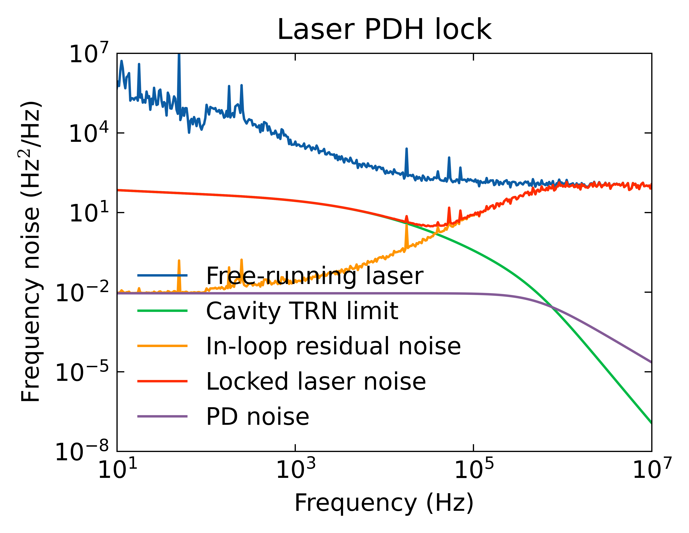
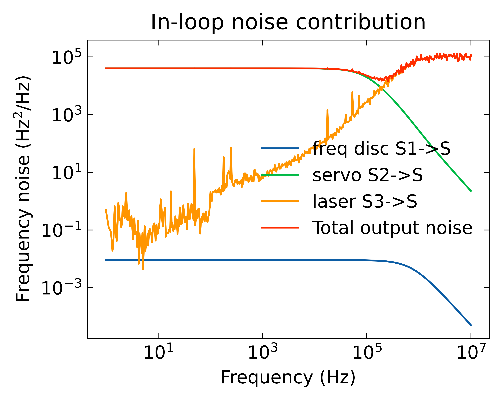

# pyCtrlLoopNoise
Python simulation and analysis tool for control loop response and noise performances, 
such as Pound-Drever-Hall (PDH), phase lock loop (PLL) and optical phase loop (OPLL).

### Control loop noise model

### Example: laser PDH lock 
The left plot shows the frequency noise performance in a laser stabilization setup, where 
the free-running laser (blue trace) is frequency locked to an optical cavity.  
This plot demonstrates (1) the locking bandwidth is about 1 MHz, (2) within the loop bandwidth 
the laser tracks the optical cavity and thus the laser noise is limited by the cavity's
thermorefreactive noise (TRN), (3) the in-loop noise has contribution from free-running laser
noise and the photodetector (PD) noise.

The right-side plot takes a closer look at the in-loop noise contribution from all blocks of the lock loop, such as
the photodetector (PD) or frequency noise discriminator, the servo and the laser.

