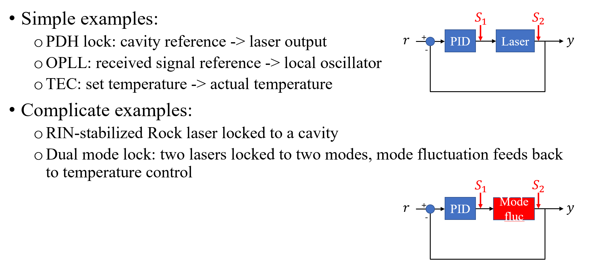
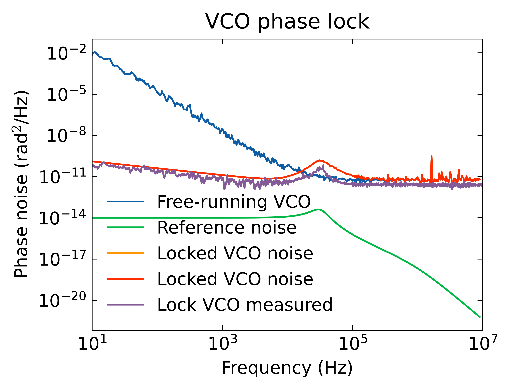

# pyphotonicsims
Python simulation and analysis tool for photonic integrated circutis and components, including:
 - Feedback control loop, Pound-Drever-Hall (PDH), phase lock loop (PLL) and optical phase loop (OPLL)
 - Semiconductor laser rate equation model, based on **The Book** _Diode Laser and Photonic Integrated Circuits_

## Installation instructions: 

```
git clone git@github.com:kaikai-liu/pyphotonicsims.git
cd pyphotonicsims
make install
```

## 1. Stimulated Brillouin scattering (SBS) laser model
The laser simulation model is based on this paper, 
Behunin, Ryan O., et al. "Fundamental noise dynamics in cascaded-order Brillouin lasers." 
Physical Review A 98.2 (2018): 023832.

 - Laser rate equations for SBS cascaded emission
$$\frac{da_m}{dt} = (i\Delta\omega - \gamma/2 + \mu(|a_{m-1}|^2 - |a_{m+1}|^2))a_m + \delta_{m0}i\sqrt(\gamma_{ex})F$$
 - Laser metrics calculation: cavity $Q$, cavity loss rates such as $\gamma = \omega/Q$ (total), 
$\gamma_{in} = \omega/Q_{in}$ (intrinsic) and $\gamma_{ex} = \omega/Q_{ex}$ (coupling/external),
threshold $P_{th}$, efficiency $\eta$, minimum ST linewidth $\nu_{ST}$

$$P_{th} = \frac{h\nu\gamma^3}{8\mu\gamma_{ex}} $$
$$\eta_{S1} = (\frac{\gamma_{ex}}{\gamma})^2$$
$$\nu_{ST,min} = \frac{n_0\gamma}{2\pi}$$

<p align="center">

</p>

## 2. Control loop noise model
<p align="center">



</p>

#### Example 1: laser PDH lock 
The left plot shows the frequency noise performance in a laser stabilization setup, where 
the free-running laser (blue trace) is frequency locked to an optical cavity.

 - The left-side plot demonstrates (1) the locking bandwidth is about 1 MHz, (2) within the loop bandwidth 
the laser tracks the optical cavity and thus the laser noise is limited by the cavity's
thermorefreactive noise (TRN), (3) the in-loop noise has contribution from free-running laser
noise and the photodetector (PD) noise.

 - The right-side plot takes a closer look at the in-loop noise contribution from all blocks of the lock loop, such as
the photodetector (PD) or frequency noise discriminator, the servo and the laser.

<p align="center">
 
</p>

#### Example 2: Phase lock loop 
The plot below shows the phase noise performance of a Mini-Circuit ZOS50+ VCO locked to an LO.

<p align="center">

</p>

